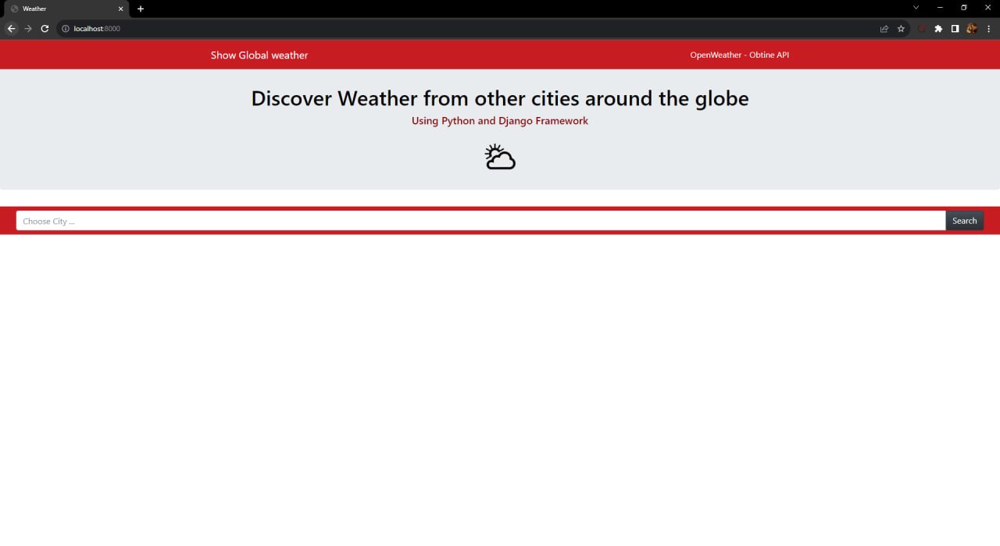
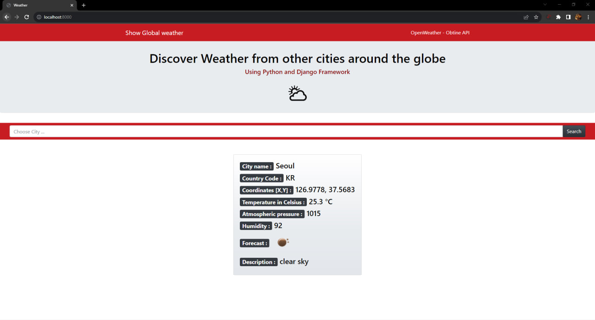
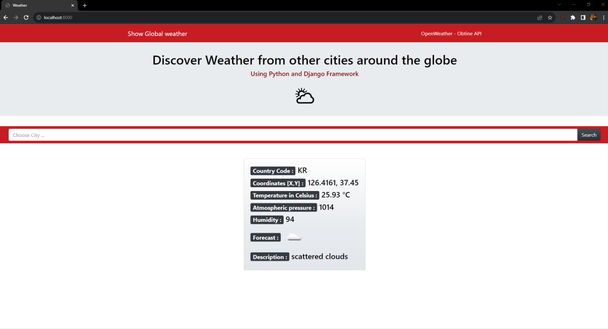
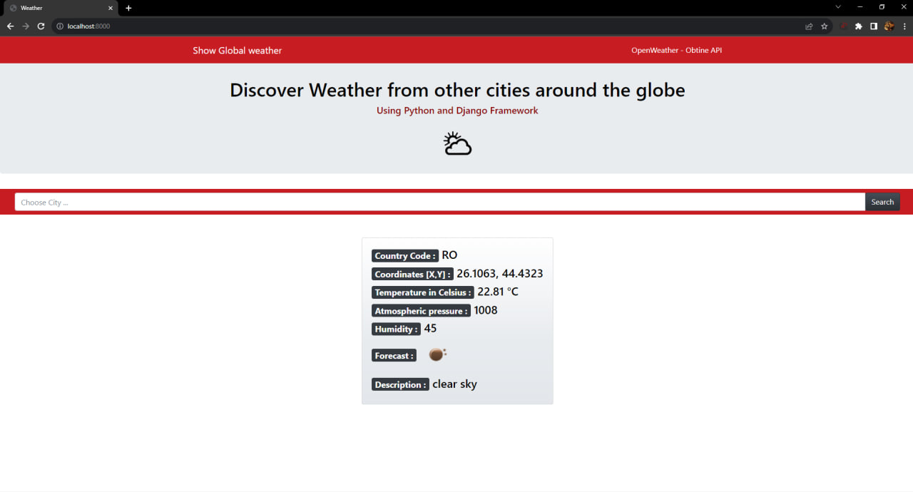
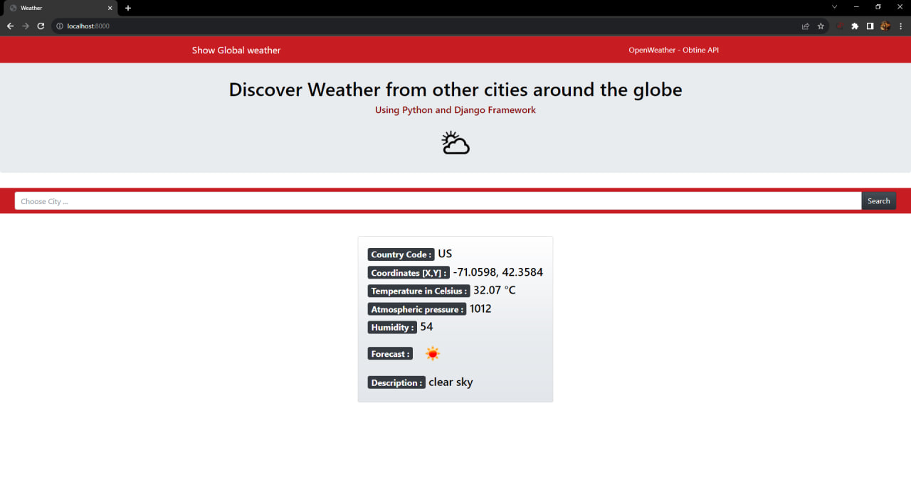

# AplicatieVreme / Weather Detection
Introdu un nume de oras din lume si afla informatii despre vreme si pozitia geografica

Codul trimite un request la API-urile orasului selectat si prin python django framework convertim fisierul API json intr-un dictionar cu valori care vor primii datele cerute. Apoi intr-o pagina html afisam rezultatele. 

API-urile au fost luate de pe site-ul https://openweathermap.org/api

# English

Enter a city name in the world and find out information about the weather and the geographical position

The code sends a request to the APIs of the selected city and through python django framework we convert the json API file into a dictionary with values ​​that will receive the requested data. Then in an html page we display the results.

The APIs were taken from https://openweathermap.org/api

After we type the comand runserver in git bash and we open our broweser and type localhost:8000 we will get this page:

What we need to do now, is just to type a name of a city on which we want to obtain information about the weather. Bellow are some examples of cities with their wether information.

## Seoul

## Incheon

## Bucharest

## Boston

